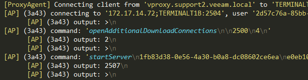

Veeam Backup & Replication logs syntax highlighting for Sublime Text
====================================================================

To install, put the Veeam B&R Logs folder inside the Packages folder in the configuration folder for Sublime Text:
* Windows: %APPDATA%\Sublime Text 3\Packages
* OS X: ~/Library/Application Support/Sublime Text 3/Packages
* Linux: ~/.config/sublime-text-3/Packages

Both Sublime Text 2 and 3 are supported.

Newly opened .log files will be automatically highlighted.

The .json file is only needed for developing the syntax definition (compiles to .tmLanguage with the AAAPackageDev package).

Some helpful tips
-----------------

To make the best out of Sublime Text, install Package Control: https://sublime.wbond.net/

I’ve found the following packages to be useful:
* Indent XML – adds an “Indent XML” command, useful for expanding Job settings, etc. into something more readable.
* Find++ — adds a “Find: In Current file” command, useful for filtering logs in the style of Notepad++.

The commands are made available through the command palette (Ctrl+Shift+P) for quick use.

Screenshots
-----------

